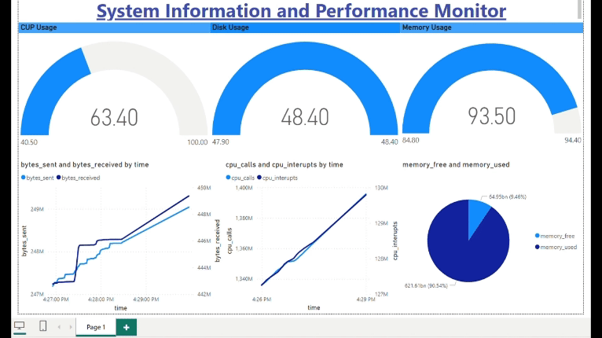

# Real-time Performance Monitoring Dashboard

## Overview
This project aims to monitor system performance metrics such as CPU usage, memory usage, network activity, and disk usage in real-time using Python, Microsoft SQL Server, and Power BI. The system metrics are collected using the `psutil` library in Python, stored in a Microsoft SQL Server database, and visualized through a Power BI dashboard.

## Components
1. **Microsoft SQL Server Table**: 
   - The SQL Server table `performance` is created to store the following system metrics:
     - `time`: Timestamp of the data collection
     - `cpu_usage`: CPU usage percentage
     - `memory_usage`: Memory usage percentage
     - `cpu_interrupts`: CPU interrupts
     - `cpu_calls`: CPU calls
     - `memory_used`: Memory used in bytes
     - `memory_free`: Free memory in bytes
     - `bytes_sent`: Bytes sent over the network
     - `bytes_received`: Bytes received over the network
     - `disk_usage`: Disk usage percentage

2. **Python Script**:
   - The Python script `performance_monitor.ipynb` collects system metrics using `psutil` and inserts them into the SQL Server table `performance` at regular intervals.

3. **Power BI Dashboard**:
   - The Power BI dashboard connects to the SQL Server database and visualizes the real-time performance metrics using various charts and graphs.

## Requirements
- Python 3.x
- `psutil` library (`pip install psutil`)
- `pyodbc` library (`pip install pyodbc`)
- Microsoft SQL Server
- Power BI Desktop

## Usage
1. Ensure that Python and the required libraries are installed.
2. Create the `performance` table in your Microsoft SQL Server database.
3. Update the connection string in the Python script (`performance_monitor.ipynb`) to connect to your SQL Server instance.
4. Run the Python script to start collecting and inserting performance data into the SQL Server table.
5. Open the Power BI Desktop and connect it to your SQL Server database.
6. Design and create visualizations in Power BI to represent the real-time performance metrics.
7. Schedule data refreshes in Power BI to keep the dashboard up-to-date.
